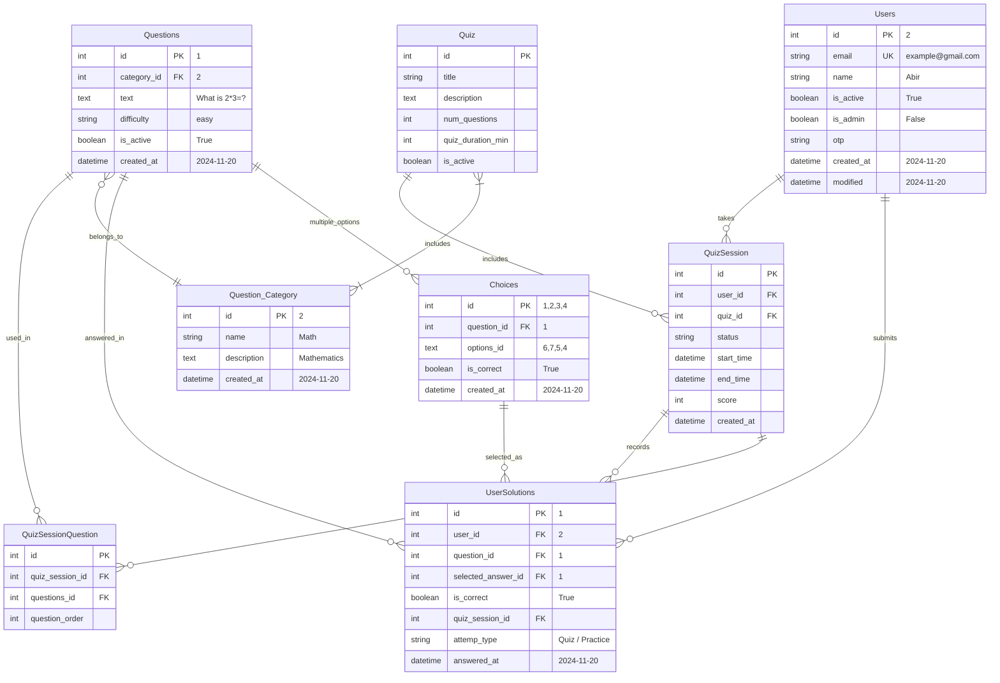

<h1 align="center">
📝Quizbit MCQ API
</h1>

<p align="center"> 
This is a MCQ Simulation API, a platform for practicing Multiple Choice Questions (MCQs).<br>
A web app that implemented Django Rest Framework and provided functionality for users to start timed quiz and submit, view their submission history.<br>
The API used PostgreSQL as the database and Django Simple JWT for authentication.
</p>

## 📑 Table of Contents
- [⭐ Features](#features)
- [🛠️ Prerequisites](#prerequisites)
- [💻 Manual Installation](#manual-installation)
- [🐳 Docker Installation](#Docker-Installation)
- [📊 Database Models](#database-models)
- [🔄 Entity Relationship Diagram](#entity-relationship-diagram)
- [🌱 Populate Database](#populate-database)

[//]: # (- [➡️ Data Flow]&#40;#data-flow&#41;)

## ⚠️ NB:  
- 🗂️ **View the project plans and tracking at a glance in [Project Tab](https://github.com/users/YeakubSadlil/projects/3) and progress in [MileStones](https://github.com/YeakubSadlil/quizbit/milestones)**

## Features

1. **User Authentication**
- User Registration with password confirmation
- OTP based email verification
- User Login with email and JWT authentication
2. **Question Retrieval**
- Retrieve a question from the database filtered by difficulty
- Retrieve a list of questions info with related multiple choice option 
3. **Answer Submission**
- Submit an answer to a question
- Validate the answer and check the result
4. **Quiz Submission**
- Start a timed quiz from the quiz list
- Real time quiz tracking with expiration, completed status
- Submit all selected solutions in a request
5. **User Submission History**
- Retrieve a list of user submission history, attempt number, accuracy (score) and time taken

## Prerequisites
- Python 3.8
- Django REST framework
- Django Simple JWT
- PostgreSQL (Database)

## Manual Installation
1. Clone the repository
```bash
git clone https://github.com/YeakubSadlil/quizbit.git
cd quizbit
```
2. Install the dependencies
```bash
pip install -r requirements.txt
```

3. Create .env file based on the .env.example
```bash
cp .env.example .env
# edit the .env based on your database and email settings
```
4. Apply the database migrations
```bash
python manage.py makemigrations
python manage.py migrate
```
5. Create a superuser for admin access
```bash
python manage.py createsuperuser
```
6. Run the server
```bash
python manage.py runserver
```

## Docker Installation
1. Clone the repository
```bash
git clone https://github.com/YeakubSadlil/quizbit.git
cd quizbit
```
2. Create .env file based on the .env.example
```bash
cp .env.example .env
# edit the .env based on your database and email settings
```
3. Create the docker container (Web + Database)
```bash
docker compose up
```
## Database Models
1. **Users:** Custom user model with email as the unique identifier
2. **Question_Category:** Category of each question like Math,Physics,Chemistry etc.
3. **Questions:** MCQ question with description, difficulty level, correctness and category
4. **Choices:** Multiple options for each question is stored with the predefined correct answer
5. **Quiz:** Quiz configuration including quiz title, duration, categories
6. **QuizSession:** Tracks individual quiz status, score and timing
7. **QuizSessionQuestion:** Maps QuizSession and Questions 
8. **UserSolutions:** Stores user submission history with his answer and time taken

## Entity Relationship Diagram


## Populate Database

1. Access admin panel at `http://localhost:8000/admin/`

2. Create Question Categories

3. Create Questions

4. Create Choices for each question

- Otherwise, import the sample database

## API Endpoints

| Endpoints                        | Method | Description                          | Authentication Required |
|----------------------------------|--------|--------------------------------------|-------------------------|
| `/api/`                          | GET | Home view with endpoints list        | No                      |
| `/api/register/`                 | POST | Register a new user                  | No                      |
| `/api/verify-otp/`               | POST | Verify a user with OTP               | No                      |
| `/api/login/`                    | POST | Login and get JWT token              | No                      |
| `/api/questionlist/`             | GET | List all questions with filters      | No                      |
| `/api/question-detail/<int:pk>/` | GET | Get a question with multiple choices | No                      |
| `/api/submit-answer/`            | POST | Submit answer in practice mode       | Yes                     |
| `/api/start-quiz/<int:quiz_id>/` | GET | Start a new quiz session             | Yes                     |
| `/api/submit-quiz/`              | POST | Submit all answers for a quiz        | Yes                     |
| `/api/user_history/`             | GET | Get user's practice history          | Yes                     |
| `/admin/`                        | GET | Admin interface                      | Admin only              |