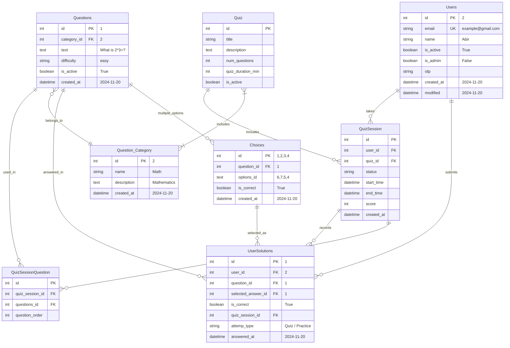

[](https://www.python.org/downloads/release/python-380/)
[](https://www.djangoproject.com/)
[](https://www.django-rest-framework.org/)
[](https://www.docker.com/)
[](https://redis.io/)
[](https://www.postgresql.org/)
[](https://opensource.org/licenses/MIT)

# 📝 Quizbit MCQ API

> A scalable and secure Multiple Choice Question (MCQ) simulation api built using **Django REST**.<br>
> Users can register via otp, login, take timed quizzes and view their submission history.<br>
> The entire system is containerized via **Docker**, **Redis** based caching, **Postgresql** as database, monitored via **Prometheus + Grafana.** 

## 📑 Table of Contents
- [⭐ Features](#-features)
- [🐳 Docker Installation](#-docker-installation-recommended)
- [💻 Manual Installation](#-manual-installation)
- [🏃 Usage](#-usage)
  - [running the project](#running-the-project)
- [🔗 API Endpoints](#-api-endpoints)
- [📊 Monitoring](#-monitoring)
- [📈 Database Models](#-database-models)
- [🔄 Entity Relationship Diagram](#-entity-relationship-diagram)
- [💬 Feedback](#-support)

[//]: # (- [🌱 Populate Database]&#40;#populate-database&#41;)

[//]: # (- [➡️ Data Flow]&#40;#data-flow&#41;)

### ⚠️ NB:  
- 🗂️ **View the project plans and tracking at a glance in [Project Tab](https://github.com/users/YeakubSadlil/projects/3) and progress in [MileStones](https://github.com/YeakubSadlil/quizbit/milestones)**

## ⭐ Features

✅. **User Authentication**
- User Registration with password confirmation
- OTP based email verification
- User Login with email and JWT authentication

✅. **Question Retrieval**
- Retrieve a question from the database filtered by difficulty
- Retrieve a list of paginated questions info with related multiple choice options 

✅. **Answer Submission**
- Submit answers in practice mode
- Validate the answer and check the result

✅. **Quiz Mode**
- Start a timed quiz from the quiz list
- Real time quiz tracking with expiration, completed status
- Submit all selected solutions at once

✅. **User Submission History**
- Retrieve a list of user submission history, attempt number, accuracy (score) and time taken

📊. **Performance Monitoring**
- Prometheus metrics collections
- Real time dashboards in Grafana for
    - Djnago performance
    - Redis usage 

🐳. **Containerization**
   - Dockerized the full project for easy deployment

[//]: # (## Prerequisites)

[//]: # (- Python 3.8)

[//]: # (- Django REST framework)

[//]: # (- Django Simple JWT)

[//]: # (- PostgreSQL &#40;Database&#41;)


## 🐳 Docker Installation (Recommended)
1. **Clone the repository**
```bash
git clone https://github.com/YeakubSadlil/quizbit.git
cd quizbit
```
2. **Set Up Environment variables:** Create .env file based on the .env.example
```bash
cp .env.example .env
# modify the .env based on your database credentials and email settings, DRF key
```
3. **Build and Run the Docker Compose:**
```bash
docker compose up --build
```
This command build the images and starts all services defined in docker-compose.yml

---
### After building image it will start the list of services below:

| Service            | Description                                               | Port Mapping<br/>..........................<br/>Host : Container | Access URL / Notes                                                     |
|--------------------|-----------------------------------------------------------|------------------------------------------------------------------|------------------------------------------------------------------------|
| **Django Web App** | Backend API built with Django REST Framework              | `8081:8080`                                                      | http://localhost:8081                                                  |
| **Postgresql DB**  | Relational database                                       | `5434:5432`                                                      | Host: `db` (for internal use)<br/> Credentials: as per .env file       |
| **Redis Cache**    | In-memory caching                                         | `6380:6379`                                                      | Host: `redis-service`, Port: `6379`                                    |
| **Redis Exporter** | Exposes Redis metrics for monitoring                      | `9121:9121`                                                      | Metrics: http://localhost:9121/metrics                                 |
| **Prometheus**     | Collects metrics from services                            | `9090:9090`                                                      | UI: http://localhost:9090                                              |
| **Grafana**        | Monitors server performance.<br/>With prebuilt dashboards | `3000:3000`                                                      | Dashboard: http://localhost:3000 <br>Default credentials: `admin/admin` |

## 💻 Manual Installation
1. Clone the repository
```bash
git clone https://github.com/YeakubSadlil/quizbit.git
cd quizbit
```
2. Install the dependencies
```bash
pip install -r requirements.txt
```

3. Create .env file based on the .env.example
```bash
cp .env.example .env
# modify the .env based on your database credentials and email settings, DRF key
```
4. Apply the database migrations
```bash
python manage.py makemigrations
python manage.py migrate
```
5. Create a superuser for admin access
```bash
python manage.py createsuperuser
```

## 🏃 Usage

### Running the project

**With Docker:** If you follow the docker installation, the services are managed by docker compose.
- **Access the API:** The API will be available at `http://localhost:8081`
- **Stop services:**
```bash
docker compose down
```

**Manual Setup:** If you follow the manual installation:
1. Ensure the Postgresql and Redis servers are running and correctly configured in your .env file.
2. Run the Django development server:
```bash
python manage.py runserver
```


## 🔗 API Endpoints
For a comprehensive list and to interact with API import the **postman collections** from the `postman_collections/` directory.

| Endpoints                        | Method | Description                          | Authentication Required |
|----------------------------------|--------|--------------------------------------|-------------------------|
| `/api/`                          | GET | Home view with endpoints list        | ❌                      |
| `/api/register/`                 | POST | Register a new user                  | ❌                      |
| `/api/verify-otp/`               | POST | Verify a user with OTP               | ❌                      |
| `/api/login/`                    | POST | Login and get JWT token              | ❌                      |
| `/api/questionlist/`             | GET | List all questions with filters      | ❌                      |
| `/api/question-detail/<int:pk>/` | GET | Get a question with multiple choices | ❌                      |
| `/api/submit-answer/`            | POST | Submit answer in practice mode       | ✅                     |
| `/api/start-quiz/<int:quiz_id>/` | GET | Start a new timed quiz session       | ✅                     |
| `/api/submit-quiz/`              | POST | Submit all answers for a quiz        | ✅                     |
| `/api/user_history/`             | GET | Get user's practice history          | ✅                     |
| `/admin/`                        | GET | Admin interface                      | Admin only              |

**JWT** Authentication is used for protected endpoints 

## 📊 Monitoring
The application performance is monitored by:
- **Prometheus:** Collects metrics from the application (via django-prometheus package) and Redis (via redis-exporter).
  - Access `Prometheus` at http://localhost:9090
- **Grafana:** Visualize the collected metrics in`Grafana`. Pre-configured dashboard are provisioned and will be automatically available during container startup.
  - Access `Grafana` at http://localhost:3000 (default credentials: admin/admin)

**N.B:** If you follow`Docker`installation then above services will be automatically available after building images.  

---
## 📈 Database Models
1. **Users:** Custom user model with email as the unique identifier
2. **Question_Category:** Category of each question like Math,Physics,Chemistry etc.
3. **Questions:** MCQ question with description, difficulty level and category
4. **Choices:** Multiple options for each question is stored with the predefined correct answer
5. **Quiz:** Quiz configuration including quiz title, duration, categories
6. **QuizSession:** Tracks individual quiz status, score and timing
7. **QuizSessionQuestion:** Maps QuizSession and Questions 
8. **UserSolutions:** Stores user submission history with answer and time taken

## 🔄 Entity Relationship Diagram


[//]: # (## Populate Database)

[//]: # ()
[//]: # (1. Access admin panel at `http://localhost:8000/admin/`)

[//]: # ()
[//]: # (2. Create Question Categories)

[//]: # ()
[//]: # (3. Create Questions)

[//]: # ()
[//]: # (4. Create Choices for each question)

[//]: # ()
[//]: # (- Otherwise, import the sample database)


## Directory Structure

```
quizbit/
├── quiz/                                   # Django app core logic 
│   ├── migrations/                         
│   ├── serializers.py
│   ├── views.py
│   ├── models.py
│   └── ...
├── monitoring/                             # Prometheus & Grafana scripts
│   ├── prometheus.yml
│   └── Grafana_Dashboards/
│        └── dashboard.yml
│        └── Django-Dashboard.json
├── .env
├── sample_database                         # Pre-populated database dump
│   └── sample_db.sql
├── postman_collections                     # Postman collections for testing API
├── docker-compose.yml
├── Dockerfile
├── manage.py
└── README.md
```

## 💬 Support
For any suggestions or issues, please [open an issue](https://github.com/YeakubSadlil/quizbit/issues).

## 📄 License
The project is licensed under the **MIT License** - see details in [LICENSE](LICENSE).