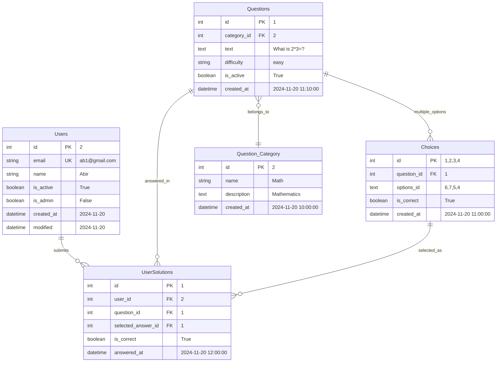
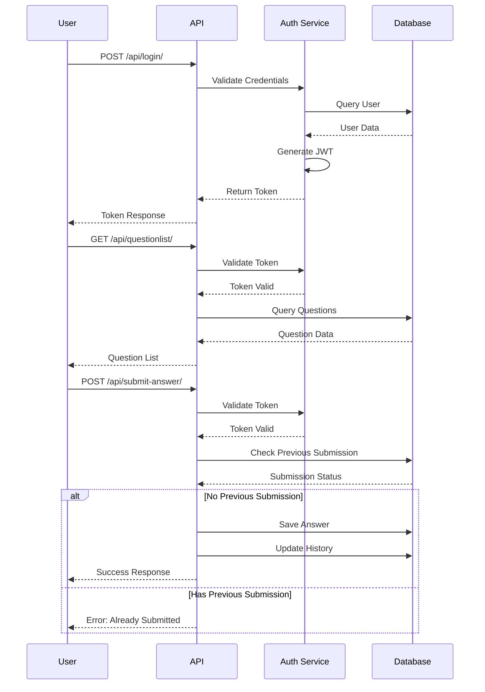

<h1 align="center">
📝Quizbit MCQ API
</h1>

<p align="center"> 
This is a MCQ Simulation API, a platform for practicing Multiple Choice Questions (MCQs).<br>
A web app that implemented Django Rest Framework and provided functionality for users to start timed quiz and submit, view their submission history.<br>
The API used PostgreSQL as the database and Django Simple JWT for authentication.
</p>

## 📑 Table of Contents
- [⭐ Features](#features)
- [🛠️ Prerequisites](#prerequisites)
- [💻 Installation](#installation) 
- [📊 Database Models](#database-models)
- [🔄 Entity Relationship Diagram](#entity-relationship-diagram)
- [🌱 Populate Database](#populate-database)
- [➡️ Data Flow](#data-flow)

## Features

1. User Authentication
- User Registration with password confirmation
- User Login with email and password
2. Question Retrieval
- Retrieve a specific question from the database
- Retrieve a list of questions from the database
3. Answer Submission
- Submit an answer to a question
- Validate the answer and check the result
4. Quiz Submission
- Start a timed quiz from the quiz list
- Submit all selected solutions in a request
5. User Submission History
- Retrieve a list of user submission history, attempt number, accuracy (score) and time taken

## Prerequisites
- Python 3.8
- Django REST framework
- Django Simple JWT
- PostgreSQL (Database)

## Installation
1. Clone the repository
```bash
git clone https://github.com/YeakubSadlil/quizbit.git
cd quizbit
```
2. Install the dependencies
```bash
pip install -r requirements.txt
```
3. Apply the database migrations
```bash
python manage.py makemigrations
python manage.py migrate
```
4. Create a superuser for admin access
```bash
python manage.py createsuperuser
```
5. Run the server
```bash
python manage.py runserver
```

## Database Models
1. **Users:** Custom user model with email as the unique identifier
2. **Question_Category:** Category of each question like Math,Physics,Chemistry etc.
3. **Questions:** MCQ question with description, difficulty level, correctness and category
4. **Choices:** Multiple options for each question is stored with the correct answer
5. **UserSolution:** Stores user submission history with his answer and time taken

## Entity Relationship Diagram


## Populate Database
1. Access admin panel at `http://localhost:8000/admin/`
2. Create Question Categories
3. Create Questions
4. Create Choices for each question
- Otherwise, import the sample database

## Data Flow

